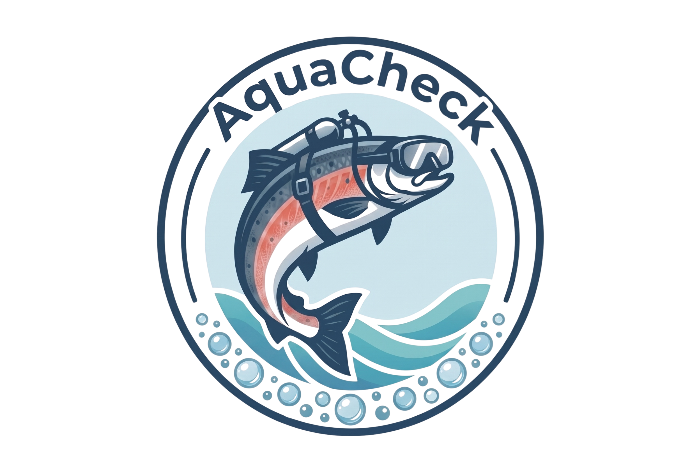
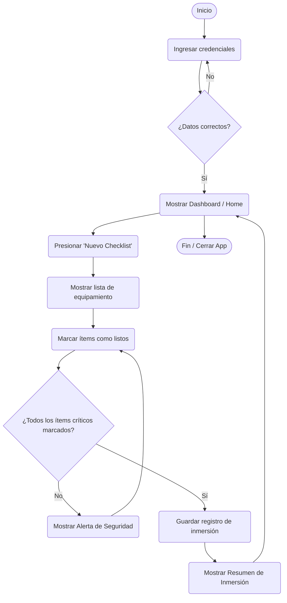

  

# AquaCheck Buceo

Aplicación móvil Android que digitaliza el pre-chequeo de seguridad antes de cada inmersión. Guía al buzo con un checklist de equipamiento, alerta cuando faltan ítems críticos y guarda una bitácora de cada inmersión validada.

## Información del proyecto

| Campo | Detalle |
|---|---|
| **Asignatura** | Desarrollo de Aplicaciones Móviles — Sección 002D |
| **Equipo** | Los Chiikawitas — Grupo 8 |
| **Plataforma** | Android (Material Design 3) |
| **Estado** | En desarrollo (MVP) |

**Problema:** hoy el chequeo de equipos, la encuesta de salud y la planificación de la faena se registran de forma manual, lo que aumenta el riesgo de error humano y no permite detener a tiempo a un buzo que no está en condiciones de entrar al agua.

**Solución:** una app que reemplaza el registro en papel por un checklist digital con validación de ítems críticos, alertas de seguridad y registro de cada inmersión.

## Integrantes y roles

| Integrante | Rol |
|---|---|
| Felipe Barra | Líder |
| Aolani Caiguan | Backend |
| Renata Orellana | Frontend |

## Funcionalidades del MVP

- Inicio de sesión de usuario.
- Dashboard con tareas pendientes y faenas en curso.
- Checklist de equipamiento con ítems críticos y alerta si falta alguno.
- Resumen de inmersión con validación final y guardado en bitácora.
- *Próximas etapas:* chequeo de salud del buzo y planificación de faena paso a paso.

## Identidad visual

Diseñada para usarse en exteriores con luz solar: alto contraste y colores inspirados en el océano.

| Principal | Secundario | Fondo | Texto | Alerta |
|:---:|:---:|:---:|:---:|:---:|
| `#005B96` | `#03A9F4` | `#F5F5F5` | `#212121` | `#D32F2F` |
|  |  |  |  |  |

## Pantallas

Diseños disponibles en [`docs/diseno/Interfaces/`](docs/diseno/Interfaces/):

- [Iniciar sesión](docs/diseno/Interfaces/iniciar_sesion.png): acceso con correo y contraseña.
- [Home / Dashboard](docs/diseno/Interfaces/home_dashboard.png): tareas pendientes y faenas en curso.
- [Checklist de equipamiento](docs/diseno/Interfaces/checklist_de_equipamiento.png): validación de equipos y alerta de ítems críticos.
- [Resumen de inmersión](docs/diseno/Interfaces/resumen_de_inmersion.png): confirmación "Apto para inmersión" y guardado en bitácora.

## Flujo de usuario (UML)

## Documentación

- [Evidencia Clase 1 — Problema y MVP](docs/evidencias/clase-01/Evidencia_Clase_01_MVP_Equipo_08.pdf)
- [Evidencia Clase 2 — Flujo de usuario y diseño](docs/evidencias/clase-02/Evidencia_Clase_02_Diseno_Equipo_08.pdf)
- [Diagrama UML](docs/diseno/diagramaUML.png)