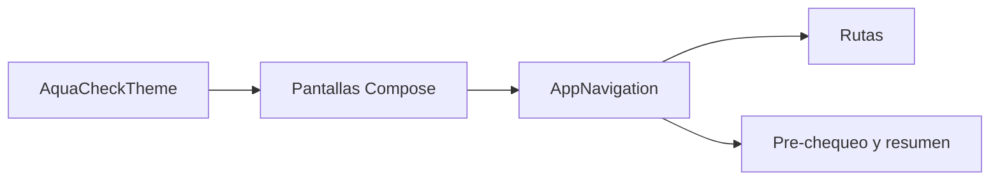
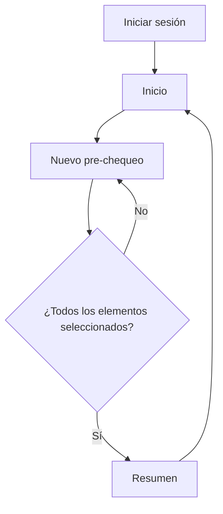

# AquaCheck Buceo


<p align="center">
  
</p>

Aplicación Android para digitalizar el pre-chequeo de seguridad previo a una faena de buceo, desarrollada para el caso académico **DSY1105 · Desarrollo de Aplicaciones Móviles**.

> ⚠️ **MVP académico.** Usa datos ficticios. No emite autorizaciones reales, no entrega diagnósticos médicos y no reemplaza los protocolos ni a los responsables reales del proceso.

## Tabla de contenidos

1. [El problema](#el-problema)
2. [La solución](#la-solución)
3. [Funcionalidades](#funcionalidades)
4. [Arquitectura](#arquitectura)
5. [Flujo implementado](#flujo-implementado)
6. [Tecnologías](#tecnologías)
7. [Identidad visual](#identidad-visual)
8. [Estructura del proyecto](#estructura-del-proyecto)
9. [Cómo ejecutarlo](#cómo-ejecutarlo)
10. [Capturas](#capturas)
11. [Estado y alcance](#estado-y-alcance)

## El problema

El chequeo de equipos previo a una inmersión suele depender de registros manuales. Esto dificulta la trazabilidad, aumenta el riesgo de olvidar elementos y retrasa la detección de condiciones que requieren atención.

## La solución

AquaCheck propone una interfaz móvil clara, con botones grandes y pocos pasos, que guía al usuario por una lista de equipamiento y evita avanzar mientras falten elementos obligatorios. El proyecto está preparado para crecer hacia persistencia local, roles y validaciones adicionales.

## Información del proyecto

| Campo | Detalle |
|---|---|
| **Asignatura** | Desarrollo de Aplicaciones Móviles — Sección 002D |
| **Equipo** | Los Chiikawitas — Grupo 8 |
| **Plataforma** | Android (Material Design 3) |
| **Estado** | En desarrollo (MVP) |

**Problema:** hoy el chequeo de equipos, la encuesta de salud y la planificación de la faena se registran de forma manual, lo que aumenta el riesgo de error humano y no permite detener a tiempo a un buzo que no está en condiciones de entrar al agua.

**Solución:** una app que reemplaza el registro en papel por un checklist digital con validación de elementos obligatorios. La persistencia y las validaciones avanzadas quedan para etapas posteriores.

## Integrantes y roles

| Integrante | Rol |
|---|---|
| Felipe Barra | Líder |
| Aolani Caiguan | Backend |
| Renata Orellana | Frontend |

## Funcionalidades

| Funcionalidad | Estado en esta entrega |
|---|---|
| Navegación Compose centralizada | Implementada |
| Barra superior y barra inferior | Implementada |
| Pre-chequeo de equipamiento | Implementado |
| Bloqueo de avance hasta seleccionar todo | Implementado |
| Resumen preliminar | Implementado |
| Persistencia con Room | Planificada |
| Login por roles | Planificado |
| Checklist TPR-24 de 17 ítems | Planificado |
| Salud del buzo, historial y post-chequeo | Planificado |

## Arquitectura

La aplicación utiliza Jetpack Compose y mantiene la navegación centralizada en `AppNavigation`. Las pantallas exponen callbacks y no crean sus propios `NavController`.



La guía del proyecto propone evolucionar esta base a MVVM con `StateFlow`, reglas de negocio y Room. Esa ampliación no forma parte de las ramas asignadas en esta entrega.

## Tecnologías

| Área | Tecnología |
|---|---|
| Lenguaje | Kotlin |
| Interfaz | Jetpack Compose y Material 3 |
| Navegación | Navigation Compose |
| Arquitectura | Separación por pantallas, componentes, navegación y tema |
| Persistencia | No implementada en esta etapa |

## Estructura del proyecto

```text
app/src/main/java/com/example/aquacheck/
├── MainActivity.kt
├── navigation/
│   ├── AppNavigation.kt
│   └── Rutas.kt
├── ui/components/
│   ├── BarraSuperior.kt
│   └── BarraInferior.kt
├── ui/screens/
│   ├── PreChequeoScreen.kt
│   ├── OpcionSeleccionable.kt
│   └── ResumenScreen.kt
└── ui/theme/
    ├── Color.kt
    ├── Theme.kt
    └── Type.kt
```

## Flujo implementado



## Identidad visual

Diseñada para usarse en exteriores con luz solar: alto contraste y colores inspirados en el océano.

| Principal | Secundario | Fondo | Texto | Alerta |
|:---:|:---:|:---:|:---:|:---:|
| `#005B96` | `#03A9F4` | `#F5F5F5` | `#212121` | `#D32F2F` |
|  |  |  |  |  |

## Pantallas

Diseños disponibles en [`docs/diseno/Interfaces/`](docs/diseno/Interfaces/):

- [Iniciar sesión](docs/diseno/Interfaces/iniciar_sesion.png): acceso con correo y contraseña.
- [Home / Dashboard](docs/diseno/Interfaces/home_dashboard.png): tareas pendientes y faenas en curso.
- [Checklist de equipamiento](docs/diseno/Interfaces/checklist_de_equipamiento.png): validación de equipos y alerta de ítems críticos.
- [Resumen de inmersión](docs/diseno/Interfaces/resumen_de_inmersion.png): confirmación "Apto para inmersión" y finalización del flujo.

## Flujo de usuario (UML)


## Documentación

- [Evidencia Clase 1 — Problema y MVP](docs/evidencias/clase-01/Evidencia_Clase_01_MVP_Equipo_08.pdf)
- [Evidencia Clase 2 — Flujo de usuario y diseño](docs/evidencias/clase-02/Evidencia_Clase_02_Diseno_Equipo_08.pdf)
- [Diagrama UML](docs/diseno/diagramaUML.png)

## Estructura de desarrollo

La implementación se organiza por funcionalidades en las siguientes ramas:

| Rama | Componentes principales |
|---|---|
| `feature/navegacion` | `AppNavigation`, `MainActivity`, `BarraSuperior` y `BarraInferior` |
| `feature/prechequeo` | `PreChequeoScreen` y `OpcionSeleccionable` |
| `feature/resumen` | `ResumenScreen` |

La interfaz está construida con Jetpack Compose y utiliza Navigation Compose para conectar las pantallas del flujo de inmersión.

## Alcance implementado

Esta entrega cubre las funcionalidades asignadas a estas ramas:

- **Navegación:** `MainActivity` aplica el tema de la aplicación y monta `AppNavigation`. El `NavHost` centraliza las rutas y el `Scaffold` comparte las barras superior e inferior.
- **Pre-chequeo:** `PreChequeoScreen` presenta el equipamiento requerido como opciones seleccionables. El botón **Continuar** permanece deshabilitado hasta confirmar todos los elementos.
- **Resumen:** `ResumenScreen` muestra el estado preliminar y permite finalizar el flujo. Actualmente no guarda información en una bitácora porque todavía no existe una capa de persistencia.
- **Documentación:** las capturas y referencias visuales se encuentran en [`docs/capturas/`](docs/capturas/).

La autenticación real, los roles, la persistencia con Room, el checklist avanzado de 17 ítems, salud del buzo, historial y post-chequeo pertenecen a etapas posteriores de la guía y no se incluyen en estas ramas.

## Cómo ejecutar la aplicación

Desde la raíz del proyecto:

```powershell
.\gradlew.bat :app:assembleDebug
```

Después, abre el proyecto en Android Studio y ejecútalo en un emulador o dispositivo conectado. También puedes instalar el APK generado en `app/build/outputs/apk/debug/app-debug.apk`.

Para ejecutar las pruebas JVM:

```powershell
.\gradlew.bat :app:testDebugUnitTest
```

## Cómo probar el flujo implementado

1. Inicia la aplicación: la ruta inicial muestra **Iniciar sesión**.
2. Pulsa **Entrar** para acceder a **Inicio**.
3. Pulsa **Nuevo pre-chequeo**.
4. Selecciona todos los elementos: Máscara y tubo, Regulador, Chaleco compensador, Cilindro de aire y Aletas.
5. Comprueba que **Continuar** está deshabilitado mientras falte un elemento.
6. Cuando todos estén seleccionados, pulsa **Continuar** para abrir el resumen.
7. Revisa el estado **Apto para inmersión** y pulsa **Finalizar pre-chequeo** para volver a Inicio.

Las opciones **Inicio**, **Historial** y **Perfil** están disponibles en la barra inferior. Historial y Perfil conservan por ahora su pantalla de referencia, ya que no forman parte de las ramas asignadas.

## Capturas

Las imágenes de referencia de las pantallas se copiaron a [`docs/capturas/`](docs/capturas/). Las capturas de ejecución deben tomarse desde el emulador o dispositivo después de completar el flujo anterior y conservarse con nombres descriptivos, por ejemplo `flujo-prechequeo.png` y `flujo-resumen.png`.

## Estado y alcance

Las ramas asignadas son:

| Rama | Trabajo |
|---|---|
| `feature/navegacion` | `AppNavigation`, `MainActivity`, `BarraSuperior` y `BarraInferior` |
| `feature/prechequeo` | `PreChequeoScreen` y `OpcionSeleccionable` |
| `feature/resumen` | `ResumenScreen` |
| `feature/readme` | Esta documentación y las referencias de `docs/capturas/` |

El flujo visual de navegación, selección del equipamiento y resumen está implementado. Login real, roles, Room, checklist de 17 ítems, salud del buzo, fotos, historial, resultado con semáforo y post-chequeo son parte del diseño objetivo de la guía, pero no se presentan como funcionalidades terminadas en esta versión.